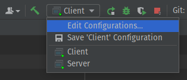

# java-group-chat
Simple command line group chat in java using AES encryption and decryption
# How to run
I'll establish steps to compile and run the program in terminal and Intellij, which is the environments I've tested on 
## Terminal
- Just compile everything under the [src/](src/) directory.
- Then run the Server.class file, it will wait for connections at port 1234 on your machine.
- Open 2-3 other terminals and run the Client.class on each one, then you can start using the program.
## Intellij
- First run the Server.main(). It will wait for connections at port 1234.
- Then run the Client.main() and open the "Edit Run/Debug configuration" dialog  
.

- Click on Modify options and choose the 'Allow multiple instances' option. And click ok (remember to run Client.main() at least one time).  
  

- Now you can run multiple instances of that class by clicking the play button  
.

